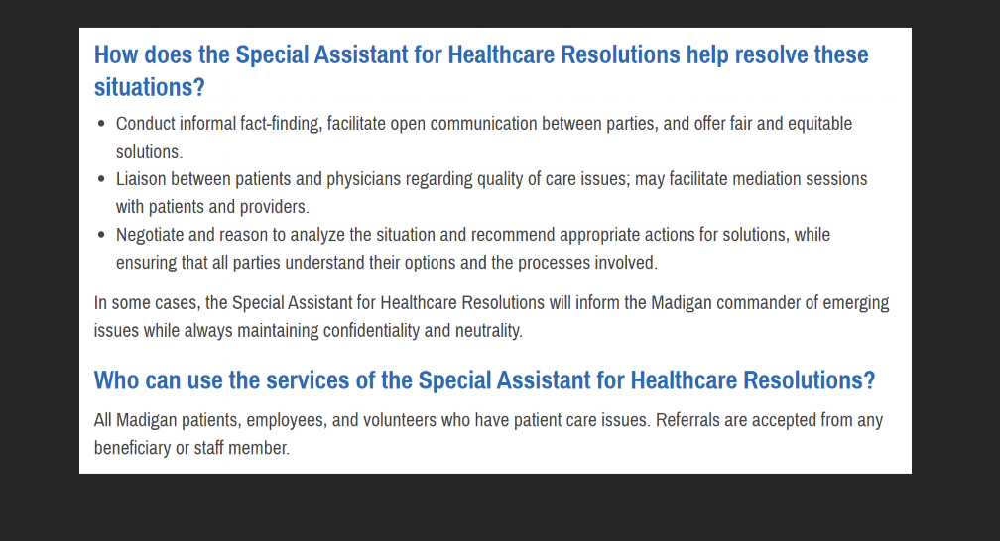

<!-- Google Tag Manager -->

<!-- End Google Tag Manager -->

<!-- Google tag (gtag.js) -->

 

 

This page was built using [Github Pages](https://docs.github.com/en/pages/quickstart) and [Github Awesome](https://github.com/sindresorhus/awesome#readme), using [Awesome Data Science](https://awesome-datascience.academic.io/) as a [source](https://github.com/academic/awesome-datascience) template.  Our source repository is [here](https://github.com/psychological-safety-yogis/awesome-psych-safety).  

# AWESOME MILITARY MENTAL HEALTH PRIVACY
 

# An awesome open-source list of ways maximize your mental health while feeling your private information is protected.  

## DISCLAIMER: Nothing in this document is to be construed as legal advice.  Just a list of links you *may* find useful . . . 
### . . . in the spirit of democratizing all of the information.

## Table of Contents
- [Table of Contents (You Are Here)](https://github.com/psychological-safety-yogis/Military-MH-and-Privacy/blob/live/README.md#table-of-contents)
- [How to edit Github READMEs and request changes](https://github.com/psychological-safety-yogis/Military-MH-and-Privacy/blob/live/README.md#preamble-a-guide-to-github-readmes-submitting-changes-and-making-your-own)
- [Related Awesome Websites](https://github.com/psychological-safety-yogis/Military-MH-and-Privacy/blob/live/README.md#related-awesome-websites)
  - [Awesome Mental Health](https://dreamingechoes.github.io/awesome-mental-health/#/)
  - [Awesome Psychological Safety](https://safetypsy.ch)
  - [Awesome Comfort and Pain Relief](https://psychological-safety-yogis.github.io/awesome-comfort-pain-relief/)
* #### [SECTION A - Top-level Federal / Congressional information](https://github.com/psychological-safety-yogis/Military-MH-and-Privacy/blob/live/README.md#section-a-top-level)
- [Congress](https://github.com/psychological-safety-yogis/Military-MH-and-Privacy/blob/live/README.md#congress)
- [Code of Federal Regulations](https://github.com/psychological-safety-yogis/Military-MH-and-Privacy/blob/live/README.md#code-of-federal-regulations)
- [Govinfo.gov](https://github.com/psychological-safety-yogis/Military-MH-and-Privacy/blob/live/README.md#govinfogov)
- [Defense.gov](https://github.com/psychological-safety-yogis/Military-MH-and-Privacy/blob/live/README.md#defensegov)
- [Documents via Washington Headquarters Services](https://github.com/psychological-safety-yogis/Military-MH-and-Privacy/blob/live/README.md#washington-headquarters-services)
- [Information via Defense Technical Information Center](https://github.com/psychological-safety-yogis/Military-MH-and-Privacy/blob/live/README.md#defense-technical-information-center)
- [Defense Health Agency](https://github.com/psychological-safety-yogis/Military-MH-and-Privacy/blob/live/README.md#defense-technical-information-center)
- [Tricare](https://github.com/psychological-safety-yogis/Military-MH-and-Privacy/blob/live/README.md#tricare)
* #### [SECTION B - Lower-level Federal](https://github.com/psychological-safety-yogis/Military-MH-and-Privacy/blob/live/README.md#section-b-lower-level)
- [Army](https://github.com/psychological-safety-yogis/Military-MH-and-Privacy/blob/live/README.md#army)
- [Navy](https://github.com/psychological-safety-yogis/Military-MH-and-Privacy/blob/live/README.md#navy)
- [Air Force](https://github.com/psychological-safety-yogis/Military-MH-and-Privacy/blob/live/README.md#air-force)
- [Marine Corps](https://github.com/psychological-safety-yogis/Military-MH-and-Privacy/blob/live/README.md#marine-corps)
- [Coast Guard](https://github.com/psychological-safety-yogis/Military-MH-and-Privacy/blob/live/README.md#coast-guard)
* #### [SECTION C - meta and Scholarly Research](https://github.com/psychological-safety-yogis/Military-MH-and-Privacy/blob/live/README.md#section-c-meta-and-scholarly-research)
- [Search engines](https://github.com/psychological-safety-yogis/Military-MH-and-Privacy/blob/live/README.md#search-engines)
- [Creative research using OSINT](https://github.com/psychological-safety-yogis/Military-MH-and-Privacy/blob/live/README.md#creative-research-using-osint-use-with-caution-and-not-on-government-machines--networks)
- [Scholarly sources](https://github.com/psychological-safety-yogis/Military-MH-and-Privacy/blob/live/README.md#scholarly-sources)
- [World Medical Association Standards](https://github.com/psychological-safety-yogis/Military-MH-and-Privacy/blob/live/README.md#world-medical-association-standards)
- [Other .org's](https://github.com/psychological-safety-yogis/Military-MH-and-Privacy/blob/live/README.md#other-org)
- [Other .com's](https://github.com/psychological-safety-yogis/Military-MH-and-Privacy/blob/live/README.md#other-com)
* #### [SECTION D - Large Language Model Tools to aid you in your journey](https://github.com/psychological-safety-yogis/Military-MH-and-Privacy/blob/live/README.md#section-d---large-language-model-tools-to-aid-you-in-your-journey-1)
- [Phind](https://github.com/psychological-safety-yogis/Military-MH-and-Privacy/blob/live/README.md#phindcom)
- [Poe](https://github.com/psychological-safety-yogis/Military-MH-and-Privacy/blob/live/README.md#poe)
- [OpenAI ChatGPT](https://github.com/psychological-safety-yogis/Military-MH-and-Privacy/blob/live/README.md#openai-chatgpt)
- [Anthropic Claude](https://docs.anthropic.com/claude/reference/getting-started-with-the-api)
- [Vercel](https://github.com/psychological-safety-yogis/Military-MH-and-Privacy/blob/live/README.md#vercel)
- [Google Vertex AI](https://github.com/psychological-safety-yogis/Military-MH-and-Privacy/blob/live/README.md#google)
* #### [SECTION E - Claims, Accountability, and FOIA](https://github.com/psychological-safety-yogis/Military-MH-and-Privacy/blob/live/README.md#section-e---claims-accountability-and-freedome-of-information)
- [Claims]()
- [FOIA]()

# PREAMBLE: A guide to Github READMEs, submitting changes, and making your own. 

| Github how-to's | Link |
| ------------- | ------------- |
| Github Repository Search Tips | [Github Repository Search Tips](https://www.freecodecamp.org/news/github-search-tips/) |
| Github Search (Official) | [github.com/features/code-search](https://github.com/features/code-search) |
| Stack Exchange answers on searching  | [stackoverflow.com/questions/3616221/search-code-inside-a-github-project](https://stackoverflow.com/questions/3616221/search-code-inside-a-github-project) |
| Github Search updated | [github.blog/changelog/2023-05-08-the-new-code-search-and-code-view-is-now-generally-available/](https://github.blog/changelog/2023-05-08-the-new-code-search-and-code-view-is-now-generally-available/) |
| Make it your own | [Fork](https://github.com/psychological-safety-yogis/awesome-psych-safety/fork) this repo, make your changes |
| Tutorial | [How to pull request](https://github.com/psychological-safety-yogis/awesome-psych-safety/blob/live/pull_request_guide.md) |  
| How to request changes | Then create a [pull (change) request](https://github.com/psychological-safety-yogis/awesome-psych-safety/pulls) |
| Something broken? | [Create issue](https://github.com/psychological-safety-yogis/awesome-psych-safety/issues) |
| Grow the Psych Safety Wiki here | [Wiki](https://github.com/psychological-safety-yogis/awesome-psych-safety/wiki) |
| Love Psychological Safety as much as we do? | [Sponsor us!](https://github.com/sponsors/psychological-safety-yogis) | 

 

# Related Awesome websites

## [Awesome Mental Health](https://dreamingechoes.github.io/awesome-mental-health/#/)
  - [Base repository](https://github.com/dreamingechoes/awesome-mental-health) 

## [Awesome Psychological Safety](https://safetypsy.ch)
  - [Base repository with PDFs and stuff](https://github.com/psychological-safety-yogis/awesome-psych-safety)

## [Awesome Comfort and Pain Relief](https://psychological-safety-yogis.github.io/awesome-comfort-pain-relief/)
  - [Base repository](https://github.com/psychological-safety-yogis/awesome-comfort-pain-relief/edit/live/README.md)

# Section A: Top-level

## Congress

 - [FY2024 NDAA: Military Mental Health Workforce Provisions Updated January 23, 2024](https://crsreports.congress.gov/product/pdf/IN/IN12268)
 - [United States Code (USC) - House.gov](https://uscode.house.gov/)
 - [10 USC 831: Art. 31. Compulsory self-incrimination prohibited - Title 10 Section 831 Edition Preliminary - USC - House.gov](https://uscode.house.gov/view.xhtml?req=\(title:10%20section:831%20edition:prelim\)%20OR%20\(granuleid:USC-prelim-title10-section831\)&f=treesort&edition=prelim&num=0&jumpTo=true)
 - [10 USC 831: Art. 31. Compulsory self-incrimination prohibited - Statutes at Large, Volume 64 - House.gov](https://uscode.house.gov/statviewer.htm?volume=64&page=118)

## Code of Federal Regulations

- [PART 2—CONFIDENTIALITY OF SUBSTANCE USE DISORDER PATIENT RECORDS](https://www.ecfr.gov/current/title-42/chapter-I/subchapter-A/part-2)
- [§ 164.512 Uses and disclosures for which an authorization or opportunity to agree or object is not required](https://www.ecfr.gov/current/title-45/subtitle-A/subchapter-C/part-164/subpart-E/section-164.512)
- [DOD Health Information Privacy Program](https://www.federalregister.gov/documents/2003/04/09/03-8624/dod-health-information-privacy-program)

## Govinfo.gov

- [Public Health Service, Confidentiality, restrictions and safeguards. 42 CFR Ch. I § 2.13 (10–1–22 Edition), Page 7](https://www.govinfo.gov/content/pkg/CFR-2022-title42-vol1/pdf/CFR-2022-title42-vol1-part2.pdf#page=7)
- [Public Health Service,  restrictions on disclosure. 42 CFR Ch. I § 2.12 (10–1–22 Edition), Page 5](https://www.govinfo.gov/content/pkg/CFR-2022-title42-vol1/pdf/CFR-2022-title42-vol1-part2.pdf#page=5)
- [same, continued Page 6](https://www.govinfo.gov/content/pkg/CFR-2022-title42-vol1/pdf/CFR-2022-title42-vol1-part2.pdf#page=6)
- [Public Health Service,  patient information. 42 CFR Ch. I § 2.23 (10–1–22 Edition), Page 12](https://www.govinfo.gov/content/pkg/CFR-2022-title42-vol1/pdf/CFR-2022-title42-vol1-part2.pdf#page=12)

## Defense.gov

- [Military Rules of Evidence, Rule 513, Psychotherapist-patient privilege, Page 38](https://jsc.defense.gov/Portals/99/Documents/MREsRemoved412e.pdf#page=38)
- [Military Rules of Evidence, Rule 301. Privilege concerning compulsory
self-incrimination, Page 3](https://jsc.defense.gov/Portals/99/Documents/MREsRemoved412e.pdf#page=3)
- [2024 MCM, Manual for Courts-Martial](https://jsc.defense.gov/Portals/99/2024%20MCM%20files/MCM%20(2024%20ed)%20(2024_01_02).pdf?ver=6Sk4QFffDE45HeNjOd7KpQ%3d%3d)
- [MCM on search, seizure, self-incrimination, Page 655](https://jsc.defense.gov/Portals/99/2024%20MCM%20files/MCM%20(2024%20ed)%20(2024_01_02).pdf?ver=6Sk4QFffDE45HeNjOd7KpQ%3d%3d#page=655)
- [Military Commander and The Law](https://media.defense.gov/2019/Apr/11/2002115350/-1/-1/0/B_0159_JAG_MILITARY_COMMANDER_AND_THE_LAW_.PDFf)
- [VICTORY WELLNESS GUIDE, 1st Infantry Division’s and Fort Riley](https://media.defense.gov/2023/Feb/01/2003154024/-1/-1/0/OVW%20Leaders%20Guide-2022-victor.PDF)
- [26 Sep 2023, New DoD Actions to Prevent Suicide in the Military, Page 2, ](https://media.defense.gov/2023/Sep/28/2003310249/-1/-1/1/NEW-DOD-ACTIONS-TO-PREVENT-SUICIDE-IN-THE-MILITARY.PDF#page=2)

- Emphasis on Lines of Efforts (LOE) 2, 3, 4:

  2) "Improve the Delivery of Mental Health Care. Mental health is vital to every
Service member' s well-being and to the overall readiness of our force . It is our
solemn obligation to provide the best possible mental health care to our men and
women in uniform. In March 2023 , I approved the immediate implementation of 10
actions related to the SPRIRC recommendations for improving access to behavioral
and mental health care. To advance this line of effort, the Department will begin
implementing 24 additional SPRIRC recommendations to improve mental health
service delivery and achieve the following priorities:
    - Expand training programs and actions to better recruit, support, and retain
mental health providers.
    - Remove obstacles to improve coordination of care.
    - Eliminate barriers to provider pay equity, timely hiring, and efficient
on boarding.
    - Increase appointment availability by revising mental health staffing models to
ensure that mental health clinics have the administrative and case management
support they need.
  3) Address Stigma and Other Barriers to Care. The Department has taken important
actions to eliminate the stubborn stigma around asking for help, and we have helped
reduce barriers to seeking mental health care. The Office of the Under Secretary of
Defense for Personnel and Readiness (USD(P&R)) has conducted a comprehensive
review and revision of policies across the Department, working to eliminate
stigmatizing language. Additionally, the Department has issued guidance to
implement the Brandon Act, which allows Service members to self-initiate referrals
for mental health evaluations and seeks to promote a culture of reaching out for help.
To continue these efforts, the Department will begin implementing 14 approved
SPRIRC recommendations to advance the following objectives:
    - Expand availability of confidential services, including non-medical
counseling for suicide prevention.
    - Increase mental health services in primary care.
    - Expand availability of tele-health care and other digital tools.
    - Provide additional resources to support unit leaders in reducing stigma.
  4) Revise Suicide Prevention Training. The Department is undertaking a foundational
shift toward a comprehensive integrated prevention strategy, applying a public-health
approach to the prevention of harmful behaviors. This will help create healthier, more
supportive environments by enhancing protections for our communities and
eliminating risk factors. The implementation of the approved recommendations of the
Independent Review Commission on Sexual Assault in the Military, specifically the
stand-up of the Integrated Primary Prevention Workforce, has been a core part of this
shift, as have our efforts to better educate Department leaders about prevention and
give them greater visibility into the data that can help them assess command climate.
Looking ahead, we need to build on the lessons learned and revise suicide prevention
training to focus more directly on stressors and risk factors that Service members face
daily. To deepen our work in this area, we will begin implementing 20 approved
SPRIRC recommendations to modernize the Department's suicide prevention and
postvention training. The Defense Suicide Prevention Office will develop the core
curriculum for this revised training, which will allow for tailoring to meet the unique
needs of each of the Military Services, to include the National Guard and Reserve.
These revisions are intended to:
    - Modernize content, delivery, and dosage of suicide prevention training.
    - Train behavioral health technicians in evidence-based practices.
    - Integrate leaders at all levels into suicide prevention training.
    - Centralize the core suicide prevention training curriculum."

## Washington Headquarters Services (documents)

- [Comprehensive Health Surveillance - DODD NUMBER 6490.02E February 8, 2012 Incorporating Change 2, August 28, 2017 - USD P&R](https://www.esd.whs.mil/Portals/54/Documents/DD/issuances/dodd/649002Ep.pdf?ver=2019-04-08-104448-613)
- [DOD INSTRUCTION 6025.13 MEDICAL QUALITY ASSURANCE AND CLINICAL QUALITY MANAGEMENT IN THE MILITARY HEALTH SYSTEM](https://www.esd.whs.mil/Portals/54/Documents/DD/issuances/dodi/602513p.pdf)
- [DOD INSTRUCTION 6025.18 HEALTH INSURANCE PORTABILITY AND ACCOUNTABILITY ACT (HIPAA) PRIVACY RULE COMPLIANCE IN DOD HEALTH CARE PROGRAMS](https://www.esd.whs.mil/Portals/54/Documents/DD/issuances/dodi/602518p.pdf?ver=2019-03-13-125803-017)
- [Mental Health Evaluations of Members of the Military Services, Page 12 - NUMBER 6490.04 March 4, 2013 Incorporating Change 1, Effective April 22, 2020](https://www.esd.whs.mil/Portals/54/Documents/DD/issuances/dodi/649004p.pdf#page=12)
- [Mental Health Evaluations of Members of the Military Services, Page 2 - NUMBER 6490.04 March 4, 2013 Incorporating Change 1, Effective April 22, 2020](https://www.esd.whs.mil/Portals/54/Documents/DD/issuances/dodi/649004p.pdf#page=2)
- [DOD INSTRUCTION 6490.08 COMMAND NOTIFICATION REQUIREMENTS TO DISPEL STIGMAS IN PROVIDING MENTAL HEALTH CARE TO SERVICE MEMBERS](https://www.esd.whs.mil/Portals/54/Documents/DD/issuances/dodi/649008p.pdf)
  - [Page 3, DOD INSTRUCTION 6490.08 COMMAND NOTIFICATION REQUIREMENTS TO DISPEL STIGMAS IN PROVIDING MENTAL HEALTH CARE TO SERVICE MEMBERS](https://www.esd.whs.mil/Portals/54/Documents/DD/issuances/dodi/649008p.pdf#page=3)
  - [Page 6, DOD INSTRUCTION 6490.08 COMMAND NOTIFICATION REQUIREMENTS TO DISPEL STIGMAS IN PROVIDING MENTAL HEALTH CARE TO SERVICE MEMBERS](https://www.esd.whs.mil/Portals/54/Documents/DD/issuances/dodi/649008p.pdf#page=6)
- [DOD MANUAL 6025.18 IMPLEMENTATION OF THE HEALTH INSURANCE PORTABILITY AND ACCOUNTABILITY ACT (HIPAA) PRIVACY RULE IN DOD HEALTH CARE PROGRAMS](https://www.esd.whs.mil/Portals/54/Documents/DD/issuances/dodm/602518m.pdf?ver=2019-03-13-123513-717)
  - [Page 25, SECTION 4. USES AND DISCLOSURES OF PHI, 4.1. GENERAL RULES ON USES OR DISCLOSURES OF PHI. Standard: Permitted and Prohibited Uses and Disclosures. DOD MANUAL 6025.18 IMPLEMENTATION OF THE HEALTH INSURANCE PORTABILITY AND ACCOUNTABILITY ACT (HIPAA) PRIVACY RULE IN DOD HEALTH CARE PROGRAMS](https://www.esd.whs.mil/Portals/54/Documents/DD/issuances/dodm/602518m.pdf?ver=2019-03-13-123513-717#page=25)
- [Page 41, Permitted Disclosures: Limited Information for Identification and Location Purposes - DOD MANUAL 6025.18 IMPLEMENTATION OF THE HEALTH INSURANCE PORTABILITY AND ACCOUNTABILITY ACT (HIPAA) PRIVACY RULE IN DOD HEALTH CARE PROGRAMS](https://www.esd.whs.mil/Portals/54/Documents/DD/issuances/dodm/602518m.pdf?ver=2019-03-13-123513-717#page=41)

  - f) "Standard: Disclosures for Law Enforcement Purposes. A DoD covered entity may
disclose PHI for a law enforcement purpose to a law enforcement official if the conditions in
Paragraphs 4.4.f.(1) through 4.4.f.(7) are met, as applicable.
    - (1) Permitted Disclosures: Pursuant to Process and as Otherwise Required By Law. A
DoD covered entity may disclose PHI:
      - (a) As required by law including laws that require the reporting of certain types of
wounds or other physical injuries, except for laws subject to Paragraph 4.4.b.(1)(b) (reports of
child abuse and neglect) or 4.4.c.(1) (reports required by law of abuse, neglect, or domestic
violence).
      - (b) In compliance with, and as limited by, the relevant requirements of:
        - 1. A court order, court-ordered warrant, subpoena, or summons issued by a
judicial officer.
        - 2. A grand jury subpoena.
        - 3. An administrative request, including an administrative subpoena or summons,
a civil or an authorized investigative demand, or similar process authorized under law, if:
          - a. The information sought is relevant and material to a legitimate law
enforcement inquiry.
          - b. The request is in writing, specific, and limited in scope to the extent
reasonably practicable in light of the purpose for which the information is sought.
          - c. De-identified information could not reasonably be used.
    - (2) Permitted Disclosures: Limited Information for Identification and Location
Purposes. Except for disclosures required by law as permitted by Paragraph 4.4.f.(1)(a), a DoD
covered entity may disclose PHI in response to a law enforcement official’s request for such
information for the purpose of identifying or locating a suspect, fugitive, material witness, or
missing person, if:
      - (a) The DoD covered entity discloses only the following information.
          - 1. Name and address.
          - 2. Date and place of birth.
          - 3. Social security number.
          - 4. ABO blood type and rhesus factor.
          - 5. Type of injury.
          - 6. Date and time of treatment.
          - 7. Date and time of death, if applicable.
          - 8. A description of distinguishing physical characteristics, including height,
          weight, gender, race, hair and eye color, presence or absence of facial hair (beard or moustache),
          scars, and tattoos.
        - (b) Except as permitted by Paragraph 4.4.f.(2)(a), the DoD covered entity does not
        disclose for the purposes of identification or location under Paragraph 4.4.f.(2) any PHI related
        to the individual’s deoxyribonucleic acid analysis, dental records, or typing, samples, or analysis
        of body fluids or tissue.
    - (3) Permitted Disclosure: Victims of a Crime. In addition to disclosures required by law
        as permitted by Paragraph 4.4.f.(1) or otherwise authorized under this section (such as
        disclosures for public health activities or disclosures about victims of abuse, neglect, or domestic
        violence), a DoD covered entity may disclose PHI in response to a law enforcement official’s
        request for such PHI about an individual who is or is suspected to be a victim of a crime (subject
        to the special rules for sexual assault and domestic abuse under Paragraph 4.4 f.(7)) if:
          - (a) The individual agrees to the disclosure; or
          - (b) The DoD covered entity is unable to obtain the individual’s agreement because of
          incapacity or other emergency circumstance, provided that:
          - 1. The law enforcement official represents that such PHI is needed to determine
        whether a violation of law by a person other than the victim has occurred, and such PHI is not
        intended to be used against the victim.
          - 2. The law enforcement official represents that immediate law enforcement
        activity that depends upon the disclosure would be materially and adversely affected by waiting
        until the individual is able to agree to the disclosure.
          - 3. The disclosure is in the best interests of the individual as determined by the
        DoD covered entity, in the exercise of professional judgment.
    - (4) Permitted Disclosure: Decedents. A DoD covered entity may disclose PHI about an
        individual who has died to a law enforcement official for the purpose of alerting law
        enforcement of the death of the individual if the DoD covered entity has a suspicion that such
        death may have resulted from criminal conduct.
    - (5) Permitted Disclosure: Crime on Premises. A DoD covered entity may disclose to a
        law enforcement official PHI that the DoD covered entity believes in good faith constitutes
        evidence of criminal conduct that occurred on the premises of the DoD covered entity.
    - (6) Permitted Disclosure: Reporting Crime in Emergencies.
      - (a) A covered health care provider providing emergency health care in response to a
      medical emergency, other than such emergency on the premises of the covered health care
      provider, may disclose PHI to a law enforcement official if such disclosure appears necessary to
      alert law enforcement to:
        - 1. The commission and nature of a crime.
        - 2. The location of such crime or of the victim(s) of such crime.
        - 3. The identity, description, and location of the perpetrator of such crime.
      - (b) If a covered health care provider believes that the medical emergency described
      in Paragraph 4.4.f.(6)(a) is the result of abuse, neglect, or domestic violence of the individual in
      need of emergency health care, Paragraph 4.4.f.(6)(a) does not apply and any disclosure to a law
      enforcement official for law enforcement purposes is subject to Paragraph 4.4.c.
    - (7) Permitted Disclosure: Sexual Assault and Domestic Abuse Cases. In cases in which
    a victim of sexual assault or domestic abuse elects restricted reporting under DoDI 6495.02 or
    DoDI 6400.06, the limitations on disclosure under these issuances apply."

## [Defense Technical Information Center](https://discover.dtic.mil/products-services/)
## EXAMPLE MATERIAL on confessions: 
### Handbook for Military Justice and Civil Law, Naval Justice School, September 2000. 
[The Summary Court Martial - Special Evidence Problem - Confessions](https://apps.dtic.mil/sti/tr/pdf/ADA384974.pdf#page=258)

## DHA

- [The Military Command Exception and Disclosing PHI of Armed Forces Personnel](https://health.mil/Reference-Center/Fact-Sheets/2022/01/05/Info-Paper-Military-Command-Exception-and-Disclosing-PHI-of-Armed-Forces-Personnel)
- [Military Command Exception](https://www.health.mil/Military-Health-Topics/Privacy-and-Civil-Liberties/HIPAA-Compliance-within-the-MHS/Military-Command-Exception)
  - Under the Military Command Exception, a covered entity may disclose the PHI of Service members for authorized
  activities to appropriate military command authorities. It is important to note that this exception does not require
  covered entities to disclose PHI to commanders, it only permits the disclosure. If disclosure is made, then only the
  minimum amount of information necessary should be provided. Further, the Exception does not permit a
  Commander’s direct access to a Service member’s electronic medical record, unless otherwise authorized by the
  Service member or the HIPAA Privacy Rule.
  - Appropriate military command authorities include commanders who exercise authority over a Service member, or
another person designated by a commander.
  -Authorized activities for which PHI may be disclosed to a commander include but are not limited to:
    - Determining the member's fitness for duty;
    - Fitness to perform a particular assignment; or
    - Carrying out any other activity essential for the military mission
  - Mental Health and/or Substance Misuse
  - To dispel stigma around Service members seeking mental health care or voluntary substance misuse education,
DoDI 6490.08 was issued to balance patient confidentiality rights with the commander’s need to make informed
operational and risk management decisions.
  - DoD healthcare providers shall not notify a Service member’s commander when the member obtains mental
health care and/or substance misuse education services – unless one of the below conditions or circumstances
apply. If they apply, then disclosure is required.
    - Harm to self. There is a serious risk of self‐harm by the member.
    - Harm to others. There is a serious risk of harm to others. This includes any disclosures concerning child
abuse or domestic violence.
    - Harm to mission. There is a serious risk of harm to a specific military mission.
    - Special personnel. The member is in the Personnel Reliability Program or has mission responsibilities of
such potential sensitivity or urgency that normal notification standards would significantly risk mission
accomplishment.
    - Inpatient care. The member is admitted or discharged from any inpatient mental health or substance
misuse treatment facility.
    - Acute medical conditions interfering with duty. The member is experiencing an acute mental health
condition or is engaged in an acute medical treatment regimen that impairs the member’s ability to
perform assigned duties.
    - Substance misuse treatment program. The member has entered into, or is being discharged from, a formal
outpatient or inpatient treatment program for the treatment of substance misuse.
    - Command‐directed mental health evaluation. The mental health services are obtained as a result of a
command‐directed mental health evaluation.
    - Other special circumstances. The notification is based on other special circumstances in which proper
execution of the military mission outweighs the interests served by avoiding notification, as determined
on a case‐by‐case basis by a covered entity.
  - If one of these circumstances or conditions applies, DoDI 6490.08 makes the disclosure to the commander
permitted AND required.
  - Substance Misuse Records
  - Covered entities shall follow the special rules in 42 CFR Part 2 regarding confidentiality of substance
misuse patient records.
- [Mental Health Stigma Campaign Will Be New Hub of Hope](https://www.health.mil/News/Dvids-Articles/2023/05/31/news445861)
- [Department of Defense Works to Dispel Stigma of Seeking Mental Health Care](https://www.health.mil/News/Dvids-Articles/2023/12/04/news458878)
- [Military Health System Mental Health Hub](https://www.health.mil/Military-Health-Topics/Mental-Health)
- [Mental Health Resources](https://www.health.mil/Military-Health-Topics/Mental-Health/Resources)
- [Suicide Prevention - Connect to Protect](https://www.health.mil/Military-Health-Topics/MHS-Toolkits/Toolkits/Mental-Health/Suicide-Prevention)
- [Mental Health Toolkit](https://www.health.mil/Military-Health-Topics/MHS-Toolkits/Toolkits/Mental-Health)
- [Psychological Health Resource Center - 24/7](https://www.health.mil/Military-Health-Topics/Centers-of-Excellence/Psychological-Health-Center-of-Excellence/Psychological-Health-Resource-Center)
  - [Psychological Health Resource Center (PHRC) Live ChatPsychological Health Resource Center Live ChatPsychological Health Resource Center (PHRC) Live Chat - Visit the 24/7 PHRC Live Chat to speak directly with a trained psychological health resource consultant. Conversations are free and confidential.](https://home-c72.niceincontact.com/incontact/chatclient/chatclient.aspx?poc=980d09d5-c178-4872-b2e5-4fcfbec6dec8&bu=4599581)
- [Real Warriors Campaign](https://www.health.mil/Military-Health-Topics/Centers-of-Excellence/Psychological-Health-Center-of-Excellence/Real-Warriors-Campaign)
- [inTransition](https://www.health.mil/Military-Health-Topics/Centers-of-Excellence/Psychological-Health-Center-of-Excellence/inTransition)

## Tricare
- [Find a Military Hospital or Clinic](https://www.tricare.mil/MTF)
- [Mental Health Care](https://www.tricare.mil/mentalhealth)
- [Mental Health Appointments](https://www.tricare.mil/CoveredServices/Mental/MentalHealthAppts)

# Section B: Military departments on-down

## Army

- [Army Regulation 27-10, Legal Services, Military Justice](https://armypubs.army.mil/epubs/DR_pubs/DR_a/ARN31271-AR_27-10-001-WEB-2.pdf)
- [3–20. Warning of rights, Page 18, Army Regulation 195-2, Criminal Investigation Activities](https://armypubs.army.mil/epubs/DR_pubs/DR_a/ARN39302-AR_195-2-001-WEB-3.pdf#page=18)
- [Army Pamphlet 27-9, Military Judges' Benchbook](https://armypubs.army.mil/epubs/DR_pubs/DR_a/pdf/web/ARN21189_P27_9_FINAL.pdf)
- [AR 15-6, Self-incrimination, Page 30, Procedures for Administrative Investigations and Boards of Officers](https://armypubs.army.mil/epubs/DR_pubs/DR_a/pdf/web/r15_6.pdf#page=30)
- [Medical Record Administration and Healthcare Documentation](https://armypubs.army.mil/epubs/DR_pubs/DR_a/pdf/web/r40_66.pdf)
- [The Military Command Exception to the Health Insurance Portability and Accountability Act](https://home.army.mil/bliss/about/news/military-command-exception-health-insurance-portability-and-accountability-act)
- [JAGC Electronic Benchbook 2.26](https://www.jagcnet.army.mil/EBB/)
- [Misc Pub 27-8 Commander's Legal Handbook 2019](https://www.jagcnet.army.mil/Sites/jagc.nsf/EE26CE7A9678A67A85257E1300563559/$File/CommandersLegalHandbook.pdf)
- [Mental Health Evaluations](https://www.jagcnet.army.mil/Sites/jagc.nsf/EE26CE7A9678A67A85257E1300563559/$File/CommandersLegalHandbook.pdf#page=250)
- [DOWNLOAD ELECTRONIC BENCHBOOK - Electronic Military Judges’ Benchbook and Installation Instructions](https://www.jagcnet.army.mil/sites/trialjudiciary.nsf/homeContent.xsp?open&documentId=900756AC675854ED8525804400729CBB)

## Navy

- [Command Directed Evaluations](https://www.med.navy.mil/Navy-and-Marine-Corps-Force-Health-Protection-Command/Population-Health/Health-Promotion-and-Wellness/LGuide-Index/Command-Evaluations/)

## Air Force

- [AFJAGC Library](https://www.afjag.af.mil/Library/HQ-JAA/OpJAGAFs-2010-2019/)
- [Senior leaders get a refresher on military law](https://www.afjag.af.mil/News/Article-Display/Article/443193/senior-leaders-get-a-refresher-on-military-law/)
- [The Military Commander and the Law – 2023 Supplement THE MILITARY COMMANDER AND THE LAW 2023 SUPPLEMENT THE OFFICE OF SPECIAL TRIAL COUNSEL](https://www.afjag.af.mil/Portals/77/documents/AFJAGS/MCL_OSTC_r.pdf)
- [2023, Military Commander and the Law Page 181, CONFIDENTIALITY AND PRIVILEGED COMMUNICATIONS](https://www.afjag.af.mil/Portals/77/documents/Publications/MCL23WEB_r.pdf?ver=Lm612nGt4LBN_j4B77k2rA%3d%3d#page=181)
- [(continued, Page 182)](https://www.afjag.af.mil/Portals/77/documents/Publications/MCL23WEB_r.pdf?ver=Lm612nGt4LBN_j4B77k2rA%3d%3d#page=182)
- [ADC - Article 31 rights](https://www.barksdale.af.mil/Units/Fact-Sheets/Display/Article/320201/adc-article-31-rights/)
- [Silence is Golden: Article 31 rights explained](https://www.ramstein.af.mil/News/Commentaries/Display/Article/305718/silence-is-golden-article-31-rights-explained/)
- [Mental Health Evaluations](https://www.jba.af.mil/Portals/38/documents/Units/Legal-Office/ADC/Mental%20Health%20Eval-2020.pdf?ver=qPDijTkUEcV9bpdN1Q-l9Q%3D%3D&timestamp=1604609153020#page=3)
  - "LACK OF CONFIDENTIALITY
    - Generally, any statements made to mental health professionals in the course of an exam or a treatment program are inadmissible against the military member in future UCMJ proceedings under the Military Rule of Evidence 513. This psychotherapist-patient privilege has several important exceptions ___and does not apply to discharge actions or other administrative actions.___  The only individuals on base with purely privileged communications are the ADC, Special  Victims Counsel (SVC), and the Chaplain. Remember your right to consult an attorney and your right against self-incrimination under the UCMJ."

## Marine Corps

- [SELF-INITIATED REFERRAL PROCESS FOR MENTAL HEALTH EVALUATIONS OF MARINES – THE BRANDON ACT - 9/18/2023 - MARADMINS Number: 463/23](https://www.marines.mil/News/Messages/Messages-Display/Article/3529205/self-initiated-referral-process-for-mental-health-evaluations-of-marines-the-br/)
- [Military Judges' Benchbook, Self encrimination raised, Page 770](https://www.mcieast.marines.mil/Portals/33/Documents/EJC/Other%20Important%20Docs/Military_Judges_Benchbook_\(Jul_03\)\(with_updates_through_Feb_08\).pdf#page=770)
- [HANDBOOK FOR MILITARY JUSTICE AND CIVIL LAW, 2006 - Page 14 - The Law of Privileges - 2-4 Rev. 1/06 - EV 2.7. Psychotherapist-Patient Privilege – Mil.R.Evd. 513](https://www.newriver.marines.mil/Portals/17/Documents/HANDBOOK%20FOR%20MILITARY%20JUSTICE%20AND%20CIVIL%20LAW%20-%20NJS%202006.pdf#page=14)
  - Mil.R.Evd. 513 established this privilege in the military. A patient has the privilege to prevent the disclosure of any
  confidential communications made between the patient and a psychotherapist, or an assistant to the psychotherapist,
  if the communication was made to facilitate diagnosis or treatment of the patient’s mental health condition. Patient
  records that pertain to any such communications between a patient and a psychotherapist are included in the
  privilege.
  Psychotherapist is defined as a psychiatrist, clinical psychologist, or any clinical social worker licensed to provide
  mental health services in any state, territory or possession of the United States. The privilege may be claimed by the
  patient, or by the psychotherapist on behalf of the patient. The rule has eight (8) exceptions to the privilege, some
  seemingly very broad. There is no privilege when:
    1. The patient is dead
    2. The communication is evidence of spouse abuse, child abuse or neglect, or in a proceeding when one
    spouse is charged with a crime against the other spouse
    3. Federal law, state law, or service regulation imposes a duty to report information contained in a
    communication.
    4. The psychotherapist believes that a patient’s mental condition makes the patient a danger to any person,
    including the patient.
    5. The communication clearly contemplated the commission of a future crime or fraud, or the
    psychotherapist’s services are sought to assist anyone in planning or committing what the patient knew or
    reasonably should have known to be a crime or fraud.
    6. It is necessary to ensure the safety and security of military personnel, military dependents, military
    property, classified information or the accomplishment of a military mission.
    7. When an accused offers statements or other evidence concerning his mental condition in defense,
    extenuation or mitigation.
    8. The admission or disclosure of the communication is constitutionally required.
  - It is highly recommended that when a legal officer identifies communications that are privileged under this rule, he
    or she seek the assistance of a judge advocate before applying any of the exceptions to force the disclosure of the
    communication in question.
- [Page 254, Summary Courts Martial, PR 13.10. APPENDIX D - ADDENDA TO TRIAL GUIDE - SPECIAL EVIDENCE PROBLEM --
CONFESSIONS](https://www.newriver.marines.mil/Portals/17/Documents/HANDBOOK%20FOR%20MILITARY%20JUSTICE%20AND%20CIVIL%20LAW%20-%20NJS%202006.pdf#page=254)
- [Glossary of words and phrases, common abbreviations, Page 345](https://www.newriver.marines.mil/Portals/17/Documents/HANDBOOK%20FOR%20MILITARY%20JUSTICE%20AND%20CIVIL%20LAW%20-%20NJS%202006.pdf#page=345)
  - CUSTODIAL INTERROGATION - questioning initiated by law enforcement officers or others in authority after a
suspect has been taken into custody or otherwise deprived of his freedom of action in any significant way.
  - CUSTODY - that restraint of free movement which is imposed by lawful apprehension.
- [Waiver of Rights, Page 46, JAGMAN Investigations Handbook](https://www.trngcmd.marines.mil/Portals/207/Docs/eoa/jagmaninveshandbook.pdf#page=46)

## Coast Guard

- [Office of Operational Medicine and Quality Improvement Division (CG-1K21)](https://www.dcms.uscg.mil/Our-Organization/Assistant-Commandant-for-Human-Resources-CG-1/Health-Safety-and-Work-Life-CG-11/Office-of-Health-Services-CG-112/Operational-Medicine-and-Quality-Improvement-Division/HIPAA-and-Health-Information-Privacy/)

## Section C: meta and Scholarly Research 

## Search Engines

- [Google search: ""mental health" AND "custodial" AND "military" AND "miranda" OR "article 31"](https://www.google.com/search?q=%22mental+health%22+AND+%22custodial%22+AND+%22military%22+AND+%22miranda%22+OR+%22article+31%22+&sca_esv=601425548&sxsrf=ACQVn09_KA0opBbNPY7v3jxcaKYB_Bsmew%3A1706198280117&ei=CIWyZdu9BoyhptQP9q6vkAM&ved=0ahUKEwjb4Zvz8_iDAxWMkIkEHXbXCzIQ4dUDCBA&uact=5&oq=%22mental+health%22+AND+%22custodial%22+AND+%22military%22+AND+%22miranda%22+OR+%22article+31%22+&gs_lp=Egxnd3Mtd2l6LXNlcnAiTSJtZW50YWwgaGVhbHRoIiBBTkQgImN1c3RvZGlhbCIgQU5EICJtaWxpdGFyeSIgQU5EICJtaXJhbmRhIiBPUiAiYXJ0aWNsZSAzMSIgSNJEUABYt0BwAHgBkAEAmAGxAqABgBeqAQgwLjE5LjAuMbgBA8gBAPgBAcICBRAhGKABwgIFECEYqwLCAggQABiABBiiBOIDBBgAIEE&sclient=gws-wiz-serp)
- [Excite (yes, the old Excite.com) will return website pages that Google ignores because it still lets you search for URLs and metadata](https://excite.com/)

## Creative research using OSINT: Use with caution and not on Government machines / networks

- [OSINT Framework.  Click on subsections and keep clicking until you've found the search tool you need.](https://osintframework.com/)
- [MetaOSINT.  Similar to above but cooler looking.  Maybe harder to use though.]{https://metaosint.github.io/chart}
- [MetaOSINT: Probably the best way to search for and filter open-source research methods](https://metaosint.github.io/table)
- [OSINT Combine: Mostly good for their bookmarks stack.](https://www.osintcombine.com/free-tools)

# Scholarly sources

## National Institutes of Health
- [ Dual loyalty among military health professionals: human rights and ethics in times of armed conflict - Leslie London, Leonard S Rubenstein, Laurel Baldwin-Ragaven, Adriaan Van Es](https://pubmed.ncbi.nlm.nih.gov/17066764/)
- [ Dual loyalty in military medical ethics: a moral dilemma or a test of integrity? - Peter Olsthoorn](https://pubmed.ncbi.nlm.nih.gov/30573701/)
- [ Legal framework versus moral framework: military physicians and nurses coping with practical and ethical dilemmas - 
Francesca Baukje Hooft](https://pubmed.ncbi.nlm.nih.gov/30904832/)

- [The Dual Roles of Military Psychiatrists: Ethical Considerations
of the HIPAA Military Command Exception
Navy Lt. Meghan Quinn, M.D.](https://www.dhaj7-cepo.com/sites/default/files/course/2022-12/S01%20Presentation.pdf)
- [Communicating With Leadership: Behavioral Health and HIPAA in the Field - Christopher G Shank, Miguel M Alampay](https://academic.oup.com/milmed/article/184/11-12/212/5574897)
- [A Code of Ethics for Military Medicine, Richard Thomas, Frederick Lough](https://academic.oup.com/milmed/article/185/5-6/e527/5803039)
- [Military Medical Ethics: Privacy, Military Necessity, and the Dual Roles of Military Psychiatrists
Meghan Quinn, M.D., Sean Wilkes, M.D., M.Sc.](https://ajp.psychiatryonline.org/doi/10.1176/appi.ajp-rj.2020.150408)
- [Military Medical Ethics Issues Regarding Dual Loyalties: Workshop Summary \(2009\)](https://doi.org/10.17226/12478)
  - [Download Link](https://nap.nationalacademies.org/login.php?record_id=12478)
  - "Dual loyalties exist in many medical fields, from occupational health to public health. Military health professionals, as all health professionals, are ethically responsible for their patients' well-being. In some situations, however, military health professionals can face unique ethical tensions between responsibilities to individual patients and responsibilities to military operations."
  - [other link](https://nap.nationalacademies.org/catalog/12478/military-medical-ethics-issues-regarding-dual-loyalties-workshop-summary)
- [Risk, rights and deservedness: Navigating the tensions of Gladue, Fetal Alcohol Spectrum Disorder and settler colonialism in Canadian courts
Jane Dickson, Michelle Stewart](https://onlinelibrary.wiley.com/doi/10.1002/bsl.2536)
- [Dual Loyalties in Military Medical Care – Between Ethics and Effectiveness - Peter Olsthoorn, Myriame Bollen & Robert Beeres](https://philarchive.org/archive/OLSDLI)
- [ Dual loyalty in military medical ethics: a moral dilemma or a test of integrity? Peter Olsthoorn ](https://philarchive.org/rec/OLSDLI-2)
  - [Dual loyalty in military medical ethics: a moral dilemma or a test of integrity?](https://militaryhealth.bmj.com/content/165/4/282)
- [Military Medical Ethics: Privacy, Military Necessity, and the Dual Roles of Military Psychiatrists
Meghan Quinn, M.D., Sean Wilkes, M.D., M.Sc.](https://psychiatryonline.org/doi/10.1176/appi.ajp-rj.2020.150408)
- [something at EBSCOHost that I can't find anymore with just the link](https://web.p.ebscohost.com/ehost/pdfviewer/pdfviewer?vid=1&sid=09fb02ee-8d3f-4ee6-8ccb-ba19c4071465%40redis)
- [Dual Loyalty among Military Health Professionals: Human Rights and Ethics in Times of Armed Conflict](https://www.cambridge.org/core/journals/cambridge-quarterly-of-healthcare-ethics/article/abs/dual-loyalty-among-military-health-professionals-human-rights-and-ethics-in-times-of-armed-conflict/A9AF365BAD5F359E076A2D19A2199936)
- [Teaching Military Medical Ethics: Another Look at Dual Loyalty and Triage](https://www.cambridge.org/core/journals/cambridge-quarterly-of-healthcare-ethics/article/abs/teaching-military-medical-ethics-another-look-at-dual-loyalty-and-triage/62B255DE712E33900FCD62D9693C7880)
- [Compromised Confidentiality in the Military Is Harmful, Charles C. Engel](https://www.rand.org/pubs/commentary/2014/10/compromised-confidentiality-in-the-military-is-harmful.html)
- [Dual loyalty in military medical ethics: A moral dilemma or a test of integrity? July 2019 - Journal of the Royal Army Medical Corps - Peter Olsthoorn, Ministry of Defense, Netherlands](https://www.researchgate.net/publication/329801888_Dual_loyalty_in_military_medical_ethics_A_moral_dilemma_or_a_test_of_integrity)
- [Medical Ethics for the Military Profession - October 2021 - Revista Científica General José María Córdova](https://www.researchgate.net/publication/356303320_Medical_Ethics_for_the_Military_Profession)
- [Compromised Confidentiality Is Harmful: Military Owes Proof to the Contrary - C. Engel - Published 29 December 2014 - Psychology, Law, Political Science](https://www.semanticscholar.org/paper/Compromised-Confidentiality-Is-Harmful%3A-Military-to-Engel/85d7ee4262d5ad41ea61d74df88500dfcaddaf4c)

## World Medical Association standards

- [WMA Declaration of Tokyo – Guidelines for Physicians Concerning Torture and other Cruel, Inhuman or Degrading Treatment or Punishment in Relation to Detention and Imprisonment ](https://www.wma.net/policies-post/wma-declaration-of-tokyo-guidelines-for-physicians-concerning-torture-and-other-cruel-inhuman-or-degrading-treatment-or-punishment-in-relation-to-detention-and-imprisonment/)
- [WMA International Code of Medical Ethics](https://www.wma.net/policies-post/wma-international-code-of-medical-ethics/)
- [WMA Statement in Times of Armed Conflict and Other Situations of Violence](https://www.wma.net/policies-post/wma-regulations-in-times-of-armed-conflict-and-other-situations-of-violence/)
- [WMA Declaration on the Protection and Integrity of Medical Personnel in Armed Conflicts and Other Situations of Violence](https://www.wma.net/policies-post/wma-statement-on-the-protection-and-integrity-of-medical-personnel-in-armed-conflicts-and-other-situations-of-violence/)
- [Dual Loyalty in Military Medicine, August 17, 2019](https://www.wma.net/wp-content/uploads/2019/10/Dual-Loyalty-Cecil-Wilson-.pdf)

## Other .org

- [Medicine’s social contract with humanity](https://www.ama-assn.org/delivering-care/public-health/ama-declaration-professional-responsibility)
- [CRIMINAL JUSTICE STANDARDS ON MENTAL HEALTH - August 8, 2016 - ABA Criminal Justice Mental Health Standards](https://www.americanbar.org/content/dam/aba/publications/criminal_justice_standards/mental_health_standards_2016.authcheckdam.pdf)
- [Patient Rights, Fitness and Suitability for Service, page 12 - DODI 6490.04, 4 Mar 2013, Mental Health Evaluations of Members of the Military Services](https://deploymentpsych.org/sites/default/files/military_culture_links/6490.04%20Mental%20Health%20Evaluations%20of%20Members%20of%20the%20Military%20Services.pdf#page=12)

## Other .com

- [Article 138 Complaints: Servicemembers’ Tool for Redress](https://nlgmltf.org/military-law/2014/article-138/)
- [Military Patients’ Privacy Rights](https://nlgmltf.org/military-law/2019/military-patients-privacy-rights/)
- [HIPAA Journal, HIPAA Exceptions, Posted By Steve Alder on Dec 1, 2023](https://www.hipaajournal.com/hipaa-exceptions/)
- [Justia, Involuntary Confessions by Criminal Suspects & Legal Concerns](https://www.justia.com/criminal/procedure/miranda-rights/involuntary-confessions/)
- [Military Justice Attorneys on rights to counsel](https://www.militaryjusticeattorneys.com/blog/fundamental-rights-the-right-to-counsel/)

# SECTION D - Large Language Model Tools to aid you in your journey

## Phind.com
- [Customize what websites Phind prioritizes](https://www.phind.com/profile)
- [Filters](https://www.phind.com/filters)
- [Search operators ("Bangs," like an exclamation mark)](https://www.phind.com/bangs)
- [Search](https://www.phind.com/search?home=true)
- [Chat](https://www.phind.com/agent?home=true)
- [Add this custom address to add Phind to your browser search engines, or use the Chrome extension if you're on Chromium-based browsers](https://www.phind.com/search?q=%s)

## Poe
- [Create a Poe bot.  It can run on many different engines (ie OpenAI, Claude, Llama, etc.)](https://poe.com/create_bot)
  - [How-to](https://developer.poe.com/prompt-bots/how-to-create-a-prompt-bot)

## OpenAI ChatGPT
- [Create your own "GPT" (custom bot)](https://help.openai.com/en/articles/8554397-creating-a-gpt)
  - [Editor](https://chat.openai.com/gpts/editor)

## Anthropic Claude
- [Getting started with Claude and Anthropic's API](https://docs.anthropic.com/claude/reference/getting-started-with-the-api)

## Vercel
- [Vercel AI](https://github.com/vercel/ai)
- [Vercel Software Developement Kit](https://vercel.com/blog/introducing-the-vercel-ai-sdk)
- [Deploying AI Applications](https://vercel.com/blog/deploying-ai-applications)
- [Getting started with Sveltekit](https://vercel.com/docs/beginner-sveltekit/getting-started)

## Google
- [Create with Vertex AI](https://console.cloud.google.com/vertex-ai/generative/multimodal/create/)

# SECTION E - Claims, Accountability, and Freedome of Information

 

 

## [DHA Inspector General Hotline](https://www.health.mil/About-MHS/OASDHA/Defense-Health-Agency/DHA-Office-of-the-Inspector-General)
- Submit Complaints to the DHA IG Hotline
    - The DHA IG Hotline provides a confidential and reliable avenue to report fraud, waste, abuse, and mismanagement. Please review the table below to determine if the DHA IG Hotline is the appropriate channel to address your issue. If you've determined that the DHA Hotline is the appropriate channel to address your issue, please download the DD Form 2949DD Form 2949 and email it to dha.ncr.dir-support.mbx.ig-hotline@health.mil or send it via postal mail to:

| What to Report to the DHA IG Hotline. The following are a few issues that ARE normally appropriate for the DHA IG Hotline. Please review the guidance below prior to submitting a complaint. | What NOT to Report to the DHA IG Hotline. Certain matters may be better resolved through other channels, instead of the DHA IG Hotline. The following is list of matters that are NOT generally investigated by the DHA OIG. Please review the guidance below prior to submitting a complaint. |
| -------------------------------------------------------------------------------------------------------------------------------------------------------------------------------------------------------------------------------------------------------------- | ------------------------------------------------------------------------------------------------------------------------------------------------------------------------------------------------------------------------------------------ |
| Fraud, waste, and abuse | 911 Emergencies |
| Gross mismanagement | Personnel matters involving requests for individual relief |
| Procurement or contract fraud |Employment related grievances and complaints against management officials  |
| Misuse of government property or equipment | Complaints of EEO/EO discrimination |
| Bribery and acceptance of gratuities | Pay and allowance matters |
| Whistleblower Reprisals |Matters relating to the Uniform Code of Military Justice to include Article 15 appeal  |
| Travel or purchase card fraud | DOD Contractor Compliance and Disclosure requirements |
| Health care fraud | DOD Employment Verification |
|-|Locating a military service member |
|-|Obtaining military records |
|-|Child and spousal support matters |
|-|TRICARE complaints|

## [AFJAG Claims Service Center](https://claims.jag.af.mil/)

## [Army JAG Claims](https://www.jagcnet.army.mil/Sites/claims.nsf/homeContent.xsp?open&documentId=BF92B85F048E9ED285257ACB0076E24Ef)

## [Claim Filing Procedures for Medical Malpractice Claims by Navy and Marine Corps Service Members](https://www.jag.navy.mil/legal-services/code-15/ndaa-medical-malpractice/)

## [Medical Malpractice Claims by Members of the Uniformed Services](https://home.army.mil/bliss/about/news/medical-malpractice-claims-members-uniformed-services#:~:text=Air%20Force%3A%20Claims%20should%20be,4620%20or%20DSN%20612%2D4620)

# FOIA
## Army
- [Army FOIA requests](https://www.hrc.army.mil/content/Freedom%20of%20Information%20and%20Privacy%20Act%20Requests)

## Navy
- [Navy FOIA](https://www.secnav.navy.mil/foia/Pages/default.aspx)
  - On 30 September, our web-based FOIA/PA portal (FOIAOnline.gov) will be decomissioned
  - To submit a FOIA request for Naval records please submit to usn.ncr.dns.mbx.don-foia-pa@us.navy.mil or US Postal mail to:
    - Navy FOIA
    - 1000 Navy Pentagon
    - Washington, DC 20350-1200

## Air Force

## Marine Corps
- [United States Marine Corps Freedom of Information Act](https://www.hqmc.marines.mil/Agencies/USMC-FOIA/)

## Space
- [Privacy, Civil Liberties, and Freedom of Information Directorate (PCLFD)](https://dpcld.defense.gov/)
- [SPACECOM Making a FOIA Request](https://www.spacecom.mil/Support/FOIA/Making-a-FOIA-Request/)
- [Space FOIA Support](https://www.spacecom.mil/Support/FOIA/)

## Coast Guard
- [Coast Guard Freedom of Information](https://www.dcms.uscg.mil/Our-Organization/Assistant-Commandant-for-Engineering-Logistics-CG-4-/FOIA/)
- [DHS How-to](https://www.dhs.gov/foia)

# More DHA stuff
- [DHA Publications](https://health.mil/Reference-Center/DHA-Publications)
- [Healthcare Resolutions, Disclosure, Clinical Conflict Management and Healthcare Provider (HCP) Resiliency and Support in the Military Health System (MHS)](https://www.health.mil/Reference-Center/DHA-Publications/2019/06/18/DHA-PI-6025-17)
- 

<!-- Google Tag Manager (noscript) -->
<noscript><iframe src="https://www.googletagmanager.com/ns.html?id=GTM-WHM52J47"
height="0" width="0" style="display:none;visibility:hidden"></iframe></noscript>
<!-- End Google Tag Manager (noscript) -->
